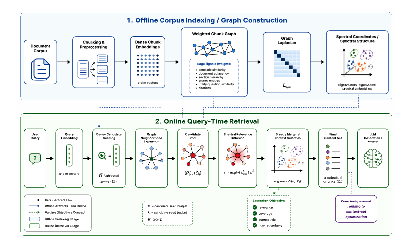

<p align="center">
  
</p>

<h1 align="center">SpectRAG — Spectral Graph-Augmented Retrieval</h1>

<p align="center">
  <a href="LICENSE"></a>
  
  
</p>

Official implementation of **SpectRAG**, a retrieval framework that improves context selection in RAG systems by augmenting dense vector retrieval with a weighted chunk graph and spectral graph structure.

Instead of retrieving only the top-ranked chunks by semantic similarity, SpectRAG selects a context set that is jointly **relevant, non-redundant, structurally connected, and sufficient for multi-hop reasoning** — then generates a grounded answer over it.

## Table of Contents

- [Stack](#stack)
- [Architecture](#architecture)
- [Demo](#demo)
- [Setup](#setup)
- [CLI Usage](#cli-usage)
- [Configuration](#configuration)
- [Project Structure](#project-structure)
- [Citation](#citation)
- [License](#license)

---

## Stack

| Component | Technology |
|---|---|
| Embeddings | `nomic-embed-text` via Ollama (768-dim, local) |
| Index-time LLM (concepts + utility questions) | OpenAI `gpt-4o-mini` (config-toggleable to local `llama3.1:8b` / spaCy NER) |
| Answer generation | OpenAI `gpt-4o-mini` |
| Vector index | FAISS IndexFlatIP (cosine via L2-normalised inner product) |
| Lexical retrieval | BM25 (`rank-bm25`), fused with dense at query time |
| Graph store | Neo4j (Bolt at `bolt://localhost:7687`) |
| Cross-encoder rerank (optional Stage 4) | `sentence-transformers` `ms-marco-MiniLM-L-6-v2` |
| Backend | FastAPI + uvicorn |
| Frontend | React + Vite + D3 v7 |

---

## Architecture

SpectRAG runs an **offline pass** that builds a weighted chunk graph and its spectral structure, then a **query-time pass** that expands, diffuses, and selects a context set before generation:

<p align="center">
  
</p>

---

## Demo

A short walkthrough of the framework in action:

<p align="center">
  
</p>

> Prefer full quality? Watch [`assets/demo.mp4`](assets/demo.mp4).

---

## Setup

### Prerequisites

- Python 3.11
- [Ollama](https://ollama.ai) running locally
- Docker (Neo4j starts automatically when the server runs)
- Node.js 18+

> **API keys.** With the default configuration, index-time concept extraction and
> utility-question generation call OpenAI `gpt-4o-mini`, so you must set an
> `OPENAI_API_KEY`. To run **fully local** (no API key, no cost), set
> `entity_extraction_mode="ner"` and `utility_question_llm_backend="ollama"` in
> `config.py` — see [Configuration](#configuration).

### 1. Pull models

```bash
ollama pull nomic-embed-text
ollama pull llama3.1:8b
```

### 2. Configure secrets (default OpenAI mode)

Create a `.env` file in the project root:

```bash
OPENAI_API_KEY=sk-...
```

Skip this step if you switch to fully-local mode as noted above.

### 3. Install Python dependencies

```bash
python3.11 -m venv .venv
source .venv/bin/activate
pip install -r requirements.txt
python -m spacy download en_core_web_lg
```

### 4. Install and build frontend

```bash
cd frontend
npm install
npm run build
cd ..
```

### 5. Start the server

```bash
.venv/bin/python3 server.py
```

> Neo4j starts automatically on first run — no separate Docker command needed.

Open `http://localhost:8000` in your browser (or run `npm run dev` in `frontend/` and open `http://localhost:5173` for the dev server with hot reload).

---

## CLI Usage

```bash
# Index a folder of documents
.venv/bin/python3 main.py index papers/

# Index specific files
.venv/bin/python3 main.py index paper1.pdf paper2.pdf

# Query from the terminal
.venv/bin/python3 main.py query "What methods improve cross-document reasoning?"

# Use a custom index location
.venv/bin/python3 main.py index docs/ --store ./my_index
.venv/bin/python3 main.py query "Summarize the key findings" --store ./my_index
```

---

## Configuration

All settings live in `config.py`. Key parameters:

| Parameter | Default | Description |
|---|---|---|
| `chunk_size` | 1200 | Tokens per chunk (tiktoken) |
| `chunk_overlap` | 100 | Overlap tokens between chunks |
| `entity_extraction_mode` | `llm_concepts` | `gpt-4o-mini` concept extraction (or `ner`) |
| `utility_question_llm_backend` | `openai` | `gpt-4o-mini` utility questions (or `ollama`) |
| `bm25_seed_enabled` / `hybrid_lexical_weight` | True / 0.30 | BM25 seed fusion + BM25 weight in the relevance vector |
| `seed_k` / `rrf_k` | 20 / 60 | Seeds per query / RRF damping |
| `graph_expansion_hops` / `max_candidates` | 2 / 200 | BFS depth / candidate pool cap |
| `diffusion_mode` / `diffusion_spectral_alpha` | `hybrid` / 0.5 | Proximity = ½spectral+½PPR / blend weight |
| `selection_mode` | `token_budget` | Stage-4 algorithm |
| `token_budget` | 12000 | Context token budget (Stage 4) |

---

## Project Structure

```
SpectRAG/
├── config.py                        # All configuration (no magic numbers elsewhere)
├── prompts.py                       # All LLM prompt templates
├── server.py                        # FastAPI server (auto-starts Neo4j on boot)
├── main.py                          # CLI entry point
├── requirements.txt
├── rag_system/
│   ├── models.py                    # Chunk, QueryResult dataclasses
│   ├── indexing/                    # Offline pipeline
│   │   ├── pipeline.py              # Orchestrates steps 1–7
│   │   ├── chunker.py               # Step 1 — document → chunks
│   │   ├── embedder.py              # Step 2 — Ollama embeddings + FAISS index
│   │   ├── graph_builder.py         # Step 4 — combines 6 edge signals
│   │   ├── spectral.py              # Step 5 — Laplacian eigenvectors → spectral coords
│   │   └── edges/
│   │       ├── semantic.py          # Cosine k-NN edges (weight 0.150)
│   │       ├── section.py           # Shared-heading edges (weight 0.200)
│   │       ├── utility_question.py  # gpt-4o-mini question edges (weight 0.280)
│   │       ├── adjacency.py         # Consecutive-chunk edges (weight 0.100)
│   │       ├── entity.py            # Shared entity/concept edges (weight 0.250)
│   │       ├── llm_concept.py       # gpt-4o-mini concept extractor (for entity edges)
│   │       └── citation.py          # Reference-overlap edges (weight 0.020)
│   ├── query/                       # Online pipeline
│   │   ├── pipeline.py              # Orchestrates stages 1–5
│   │   ├── seed_retrieval.py        # Stage 1 — dense + BM25 + utility-question fusion (RRF)
│   │   ├── graph_expansion.py       # Stage 2 — Neo4j BFS expansion
│   │   ├── diffusion.py             # Stage 3 — spectral / PPR / hybrid proximity re-scoring
│   │   └── cluster_selection.py     # Stage 4 — token-budget selection (+ alt modes)
│   ├── generation/
│   │   └── generator.py             # Stage 5 — gpt-4o-mini answer generation
│   ├── store/
│   │   ├── index_store.py           # chunks.pkl + faiss.index persistence
│   │   └── neo4j_client.py          # Neo4j graph I/O
│   └── ner/
│       └── extractor.py             # spaCy + optional GLiNER
└── frontend/
    └── src/
        ├── App.jsx
        ├── components/
        │   ├── ChatPanel.jsx        # Query input + message thread
        │   ├── MessageBubble.jsx    # Answer bubble + expandable sources
        │   ├── GraphPanel.jsx       # D3 spectral graph visualization
        │   ├── Sidebar.jsx          # Session management
        │   └── AddDocsModal.jsx     # Document upload flow
        └── api.js                   # REST client
```

---

> **Note.** `rag_index/` and the evaluation working directories are in
> `.gitignore` — do not commit them. They hold large binaries (`chunks.pkl`,
> `faiss.index`) that change on every re-index; regenerate locally with
> `python main.py index <your-docs>`.

---

## Citation

Citation information will be added after the arXiv preprint is released.

## License

Released under the [MIT License](LICENSE) — © 2026 The SpectRAG Authors.
